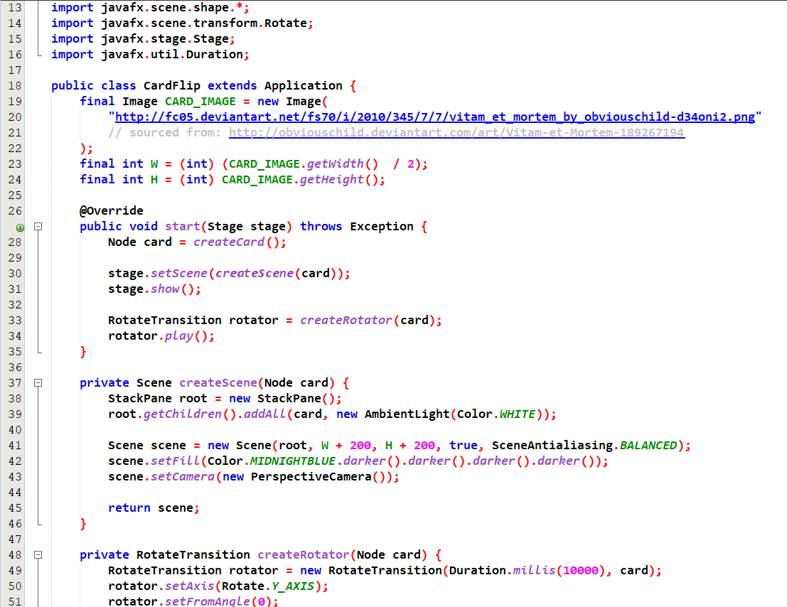
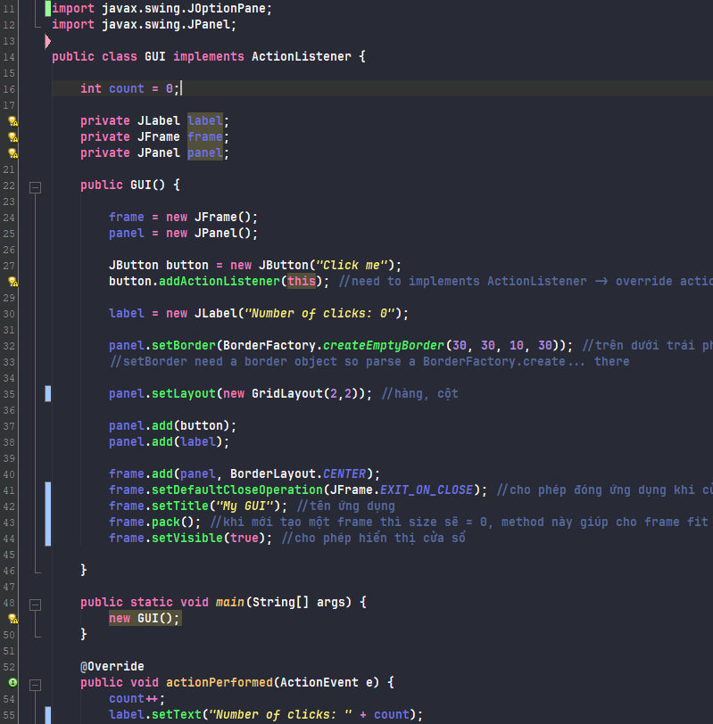

# 1. Giới thiệu
  ## Light
  
  ## Dark
  
# 2. Cách sử dụng:
  - Tools -> Options: Chú ý 2 mục Fonts & Colors và Appearance
  - Set up cơ bản: 
  	- Monospaced Bold 18 
  	- Comment sang màu xanh (do màu mặc định hơi khó nhìn đối với mình :>)
  - Set up theme light: 
  	- Fonts & Color: Import-> Browse-> /light/light-theme.zip 
  	- Restart...
  - Set up theme dark:
  	- Trước tiên cần phải cài plugin Dracular để đổi màu thanh side bar (nhìn cho đồng bộ)
  		- Tools -> Plugins -> Downloaded -> Add Plugins... -> 1501524971_nb-darcula-1.6.nbm 
  		- Restart... 
  		- Khi mở lên thì ta được một giao diện mặc định của gói theme 
   		- Tools -> Options -> Fonts & Color: Import-> Browse-> /light/dark-theme.zip
  		- Restart...
  		- Tools -> Options -> Appearance -> Look and Feel: Darcula
  		- Tools -> Options -> Fonts & Color -> Profile   : Darcula
Trong hình mình sử dụng font JetBrains Mono với settting JetBrains Mono Bold 18
    - Support Ligature
